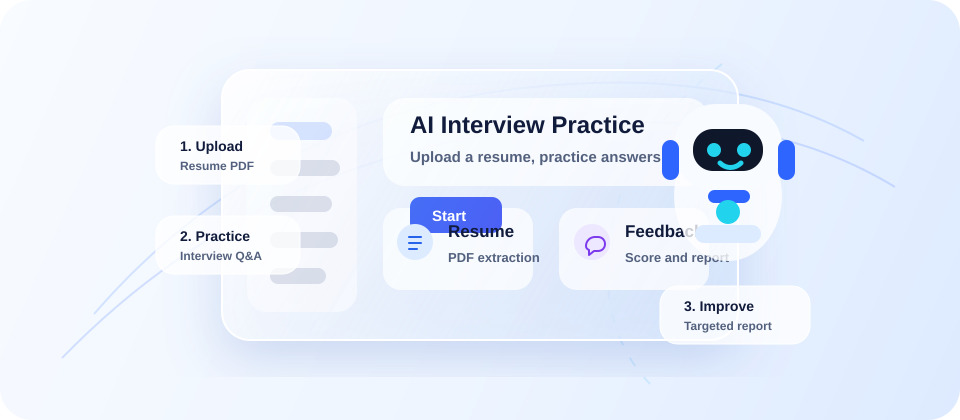
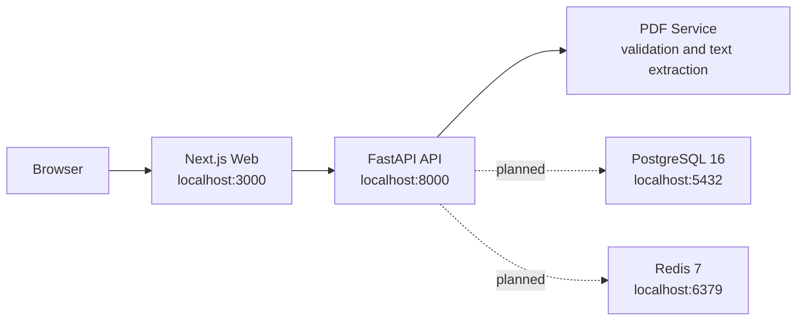

# YanJing-AI

English | [简体中文](./README.md)

YanJing is an AI interview simulator. Upload a resume, get role-specific interview questions, practice your answers, and receive feedback with improvement suggestions.

Current version: **V0.1**. PDF upload, validation, and text extraction are working. Auth, interview, evaluation, and report endpoints are still stubs.

<p align="center">
  
</p>

## Feature Status

| Module | Status | Notes |
| --- | --- | --- |
| Homepage | Working | Product landing page for the AI interview coach |
| Resume upload | Working | PDF upload, validation, and text extraction |
| Auth | Stub | Endpoint placeholder only |
| Interview questions | Stub | Endpoint placeholder only |
| Answer evaluation | Stub | Endpoint placeholder only |
| Reports | Stub | Endpoint placeholder only |

## Tech Stack

| Layer | Tech |
| --- | --- |
| Frontend | Next.js 14 App Router, React 18, TypeScript, Tailwind CSS 3 |
| Backend | Python 3.11, FastAPI, uvicorn |
| PDF | pypdf |
| Infra | Docker Compose, PostgreSQL 16, Redis 7 |

## Architecture



## Project Structure

```text
yanjing-web/          # Next.js frontend
  app/                # Routes: /, /resume, /interview, /login, /diagnosis, /report
  public/images/      # Layered homepage visual assets
yanjing-api/          # FastAPI backend
  app/
    api/              # auth, resume, interview, evaluation, report routers
    services/         # Business logic, including pdf_service.py
    schemas/          # Pydantic schemas
    prompts/          # LLM prompt templates
docker-compose.yml    # Starts web, api, postgres, and redis
```

## Quick Start

Run from the repository root:

```bash
docker compose up
```

Default URLs:

- Frontend: `http://localhost:3000`
- Backend API: `http://localhost:8000`
- Health check: `http://localhost:8000/health`
- PostgreSQL: `localhost:5432`
- Redis: `localhost:6379`

## Run the Frontend Only

```bash
cd yanjing-web
npm install
npm run dev
```

The frontend runs on `http://localhost:3000` by default.

Useful commands:

```bash
npx tsc --noEmit
npm run build
npm run lint
```

Note: if ESLint has not been configured yet, `npm run lint` may open Next.js' interactive setup prompt.

## Run the Backend Only

```bash
cd yanjing-api
pip install -r requirements.txt
uvicorn app.main:app --reload --port 8000
```

Check the service:

```bash
curl http://localhost:8000/health
```

## API

| Method | Path | Status | Description |
| --- | --- | --- | --- |
| `GET` | `/health` | Working | Health check |
| `POST` | `/api/resume/upload` | Working | Upload and parse a PDF resume |
| `POST` | `/api/auth/login` | Stub | Login |
| `POST` | `/api/interview/question` | Stub | Generate interview questions |
| `POST` | `/api/evaluation/answer` | Stub | Evaluate an answer |
| `GET` | `/api/report/session/{session_id}` | Stub | Fetch a session report |

### Upload a Resume

```bash
curl -X POST http://localhost:8000/api/resume/upload \
  -F "file=@./resume.pdf"
```

Response fields include:

- `filename`
- `size_bytes`
- `page_count`
- `raw_text`

## Development Notes

- The frontend and backend are independent apps. There is no shared package workspace yet.
- The frontend uses the App Router under `yanjing-web/app/`, not the legacy `pages/` router.
- The frontend alias `@/*` maps to `yanjing-web/app/*`.
- Backend API handlers live in `yanjing-api/app/api/`.
- Backend business logic lives in `yanjing-api/app/services/`.
- Backend request and response models live in `yanjing-api/app/schemas/`.
- API errors should use `HTTPException` with explicit HTTP status codes.
- PostgreSQL and Redis are started by Docker Compose, but they are not wired into business logic yet.

## Roadmap

- Add authentication
- Generate interview questions from resume content and target roles
- Integrate an LLM-based answer evaluator
- Generate structured capability reports
- Wire PostgreSQL and Redis into real workflows

## Visual Assets

The homepage hero visual uses layered images plus HTML/CSS UI:

- `yanjing-web/public/images/orbit-lines.svg`
- `yanjing-web/public/images/device-frame.png`
- `yanjing-web/public/images/robot.png`
