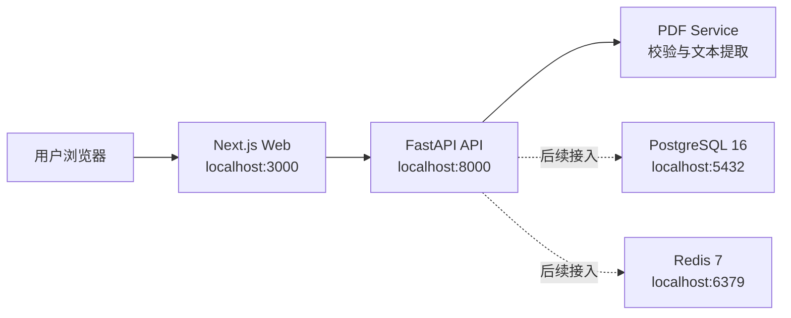

# YanJing-AI（言镜）

[English](./README.en.md) | 简体中文

YanJing（言镜）是一个 AI 面试模拟器：上传简历，获得岗位相关面试问题，练习回答，并接收反馈与改进建议。

当前版本为 **V0.1**：PDF 上传、安全校验和文本提取已可用；认证、面试、评估和报告接口仍处于 stub 阶段。

<p align="center">
  
</p>

## 功能状态

| 模块 | 状态 | 说明 |
| --- | --- | --- |
| 首页 | 可用 | AI 面试陪练产品展示页 |
| 简历上传 | 可用 | 支持 PDF 上传、校验和文本提取 |
| 认证 | Stub | 仅保留接口入口 |
| 面试问题 | Stub | 仅保留接口入口 |
| 回答评估 | Stub | 仅保留接口入口 |
| 报告 | Stub | 仅保留接口入口 |

## 技术栈

| 层级 | 技术 |
| --- | --- |
| Frontend | Next.js 14 App Router, React 18, TypeScript, Tailwind CSS 3 |
| Backend | Python 3.11, FastAPI, uvicorn |
| PDF | pypdf |
| Infra | Docker Compose, PostgreSQL 16, Redis 7 |

## 架构示意



## 目录结构

```text
yanjing-web/          # Next.js 前端
  app/                # 路由：/, /resume, /interview, /login, /diagnosis, /report
  public/images/      # 首页分层视觉资源
yanjing-api/          # FastAPI 后端
  app/
    api/              # auth, resume, interview, evaluation, report routers
    services/         # 业务逻辑，例如 pdf_service.py
    schemas/          # Pydantic schemas
    prompts/          # LLM prompt templates
docker-compose.yml    # 启动 web、api、postgres、redis
```

## 快速启动

在仓库根目录运行：

```bash
docker compose up
```

默认地址：

- 前端：`http://localhost:3000`
- 后端 API：`http://localhost:8000`
- 健康检查：`http://localhost:8000/health`
- PostgreSQL：`localhost:5432`
- Redis：`localhost:6379`

## 单独运行前端

```bash
cd yanjing-web
npm install
npm run dev
```

前端默认运行在 `http://localhost:3000`。

常用命令：

```bash
npx tsc --noEmit
npm run build
npm run lint
```

注意：如果项目还没有 ESLint 配置，`npm run lint` 可能会进入 Next.js 的交互式初始化提示。

## 单独运行后端

```bash
cd yanjing-api
pip install -r requirements.txt
uvicorn app.main:app --reload --port 8000
```

检查服务：

```bash
curl http://localhost:8000/health
```

## API

| Method | Path | 状态 | 说明 |
| --- | --- | --- | --- |
| `GET` | `/health` | 可用 | 健康检查 |
| `POST` | `/api/resume/upload` | 可用 | 上传并解析 PDF 简历 |
| `POST` | `/api/auth/login` | Stub | 登录 |
| `POST` | `/api/interview/question` | Stub | 生成面试问题 |
| `POST` | `/api/evaluation/answer` | Stub | 评估回答 |
| `GET` | `/api/report/session/{session_id}` | Stub | 获取会话报告 |

### 上传简历

```bash
curl -X POST http://localhost:8000/api/resume/upload \
  -F "file=@./resume.pdf"
```

返回字段包括：

- `filename`
- `size_bytes`
- `page_count`
- `raw_text`

## 开发说明

- 前后端是两个独立应用，当前没有共享 workspace 包。
- 前端使用 `yanjing-web/app/` 下的 App Router，不使用 legacy `pages/`。
- 前端路径别名 `@/*` 指向 `yanjing-web/app/*`。
- 后端接口逻辑放在 `yanjing-api/app/api/`。
- 后端业务逻辑放在 `yanjing-api/app/services/`。
- 后端请求/响应模型放在 `yanjing-api/app/schemas/`。
- API 错误使用 `HTTPException` 和明确的 HTTP 状态码。
- PostgreSQL 和 Redis 已由 Docker Compose 启动，但当前尚未接入业务逻辑。

## 路线图

- 接入用户认证
- 基于简历和目标岗位生成面试问题
- 接入 LLM 评估回答
- 生成结构化能力报告
- 将 PostgreSQL 和 Redis 接入真实业务流程

## 视觉资源

首页 Hero 右侧视觉使用分层图片与 HTML/CSS UI 组合：

- `yanjing-web/public/images/orbit-lines.svg`
- `yanjing-web/public/images/device-frame.png`
- `yanjing-web/public/images/robot.png`
